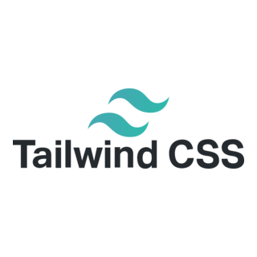
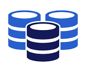
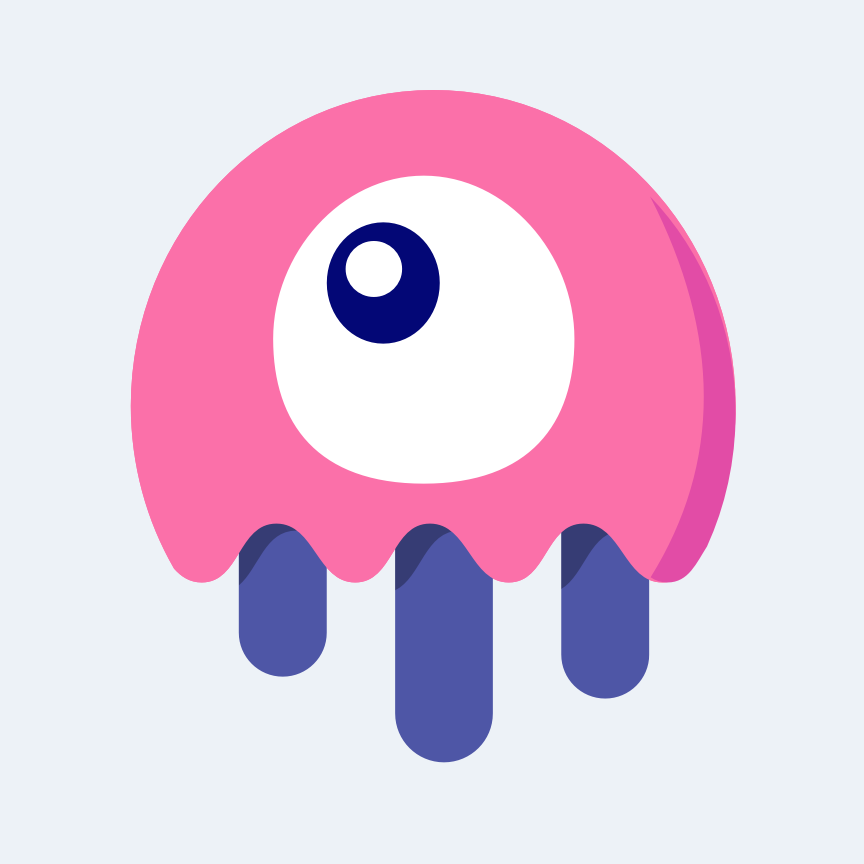

<!-- Banner Image -->

  

<!-- Name and Designation -->
<h1 align="center">👋 Hi, I’m Belal Hossen</h1>
<h3 align="center">💻 Senior Full Stack Developer | Laravel & MERN Stack | Vue |Chatbot develop|API Integrator</h3>

<!-- About Me Section -->

## 🧑‍💻 About Me

I'm **Belal Hossen**, a passionate Full Stack Web Developer with over **3+ years of Laravel and MERN stack** experience.  
Currently working as a **Senior Developer at [Softexel Technologies](https://softexel.com/)**.

I specialize in building scalable web applications, RESTful APIs, third-party integrations, and real-time features using Laravel, Livewire, Alpine.js, React, Vue, and more. I have experience with both SQL and NoSQL databases, as well as cloud and container deployments.

I’ve also built and published custom Laravel packages that are used across multiple projects — focusing on clean, reusable, and testable code.

### 🔍 Currently Working On:

- 🔗 Integrating **AI and ChatGPT into Laravel E-commerce**
- 🌐 Developing a **Next.js-based personal project**
- 🌐 Developing a **React based ptc website**
- 🌐 Developing a **Planing to create a affiliate tracking system based on laravel and react**
- 🏘 Building a **real estate chatbot using laravel and openai Fine tune**
- 📦 Creating **Laravel packages** to streamline workflows

---

<!-- Skills Section with GIFs -->

## 🛠️ Skills & Technologies

<table>
<tr>
  <td align="center" width="160">
     
    <strong>Laravel</strong> 
    REST APIs, Livewire, Sanctum
  </td>
  <td align="center" width="160">
     
    <strong>React / Next.js</strong> 
    Hooks, SSR, Tailwind
  </td>
  <td align="center" width="160">
     
    <strong>Vue.js</strong> 
    SPA, Vite, Axios
  </td>
  <td align="center" width="160">
     
    <strong>Tailwind CSS/Bootstrap</strong> 
    Utility-First Styling
  </td>
</tr>
<tr>
  <td align="center" width="160">
     
    <strong>MySQL / MongoDB</strong> 
    Schema Design, Indexing
  </td>
  <td align="center" width="160">
     
    <strong>JavaScript</strong> 
    ES6+, Alpine.js
  </td>
  <td align="center" width="160">
     
    <strong>Livewire</strong> 
    Laravel Reactive UIs
  </td>
  <td align="center" width="160">
     
    <strong>Node.js / Express</strong> 
    REST APIs, Server-Side Logic
  </td>
</tr>
</table>

---

<!-- Social Links -->

## 🌐 Connect With Me

&nbsp;

&nbsp;

&nbsp;

&nbsp;

<!-- GitHub Stats -->
## 📊 GitHub Stats

<table>
  <tr>
    <td>
      
    </td>
    <td>
      
    </td>
  </tr>
  <tr>
    <td colspan="2" align="center">
      
    </td>
  </tr>
</table>

---

<!-- Optional: Packages -->

## 📦 Laravel Package Development

- Developed and published reusable **Laravel packages** to improve team productivity and code quality
- Familiar with: `composer init`, package service providers, config files, publishing assets, routes, views, migrations
- Focus on **modular, maintainable architecture**

---

<!-- Optional: Projects -->

## 🚀 Featured Projects

- 🏘 **Real Estate CRM Platform** – OAuth, MortgageCoach, Moxo, FollowUp Boss
- 🛒 **E-commerce with AI** – ChatGPT recommendations + Stripe integration
- 👨‍💼 **Freelancer Service Platform** – Laravel Livewire + Tailwind CSS
- 🌐 **Affiliate Network System** – Custom commission engine & real-time stats

---
